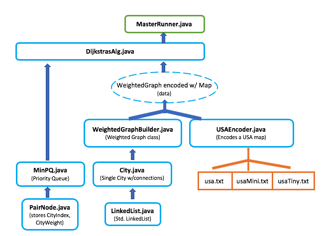

## MapRouting Project README

## Files Overview

**Java Files:** `MasterRunner.java`, `WeightedGraphBuilder.java`, `USAEncoder.java`, `DijkstrasAlg.java`, `City.java`, `MinPQ`, `PairNode.java`, `LinkedList.java`

**Text Files:** `usa.txt`, `usaMini.txt`, `usaTiny.txt`

To use the program, run MasterRunner.java's main. The console will prompt you from there.

## Class Structure Overview
The class heirarchy/dependancies are as follows:

`MasterRunner.java`, being the "front end," is what the user interacts with. To find a path from inputted start and end indices (not shown) utilizes  `DijkstrasAlg.java` which requires a Weighted Graph that's encoded with a map. `WeightedGraphBuilder.java` and `USAEncoder.java` work together to create this Map-encoded-graph. 
`WeightedGraphBuilder` encodes graphs as "adjacency matrix" where an array of `City.java`'s are the cities, which each have a `LinkedList.java` of connections.
`USAEncoder.java` encodes any "map data" into a given graph. The three included are `usa.txt`, `usaMini.txt`, `usaTiny.txt`.
`MinPQ.java` is the priority queue used in Dijkstra's Algorithm. It's implemented with a heap. It's generic, but currently takes in `PairNode.java`'s which store a given city's Index and Weight. The weight is calculated based on pervious nodes.
